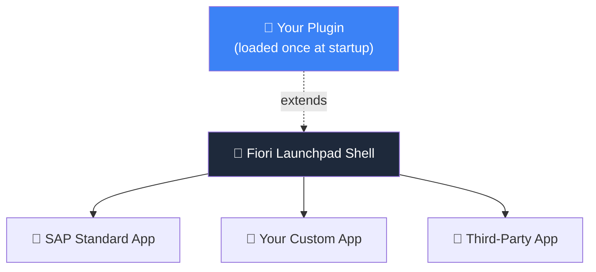

# What are Fiori Launchpad Plugins?

When people talk about UI5 development, they usually mean...

- 📱 **UI5 Applications** — everybody knows them
- 📚 **UI5 Libraries** — reusable controls & helpers
- 🧩 **FLP Plugins** — the overlooked third option

**A plugin runs inside the Fiori shell** — activated once, it can apply to
<b>all</b> apps and the FLP home page itself: your own, SAP standard, even third-party UI5 apps.

⚠️ SAPUI5 only — <code>sap.ushell</code> is not part of OpenUI5

