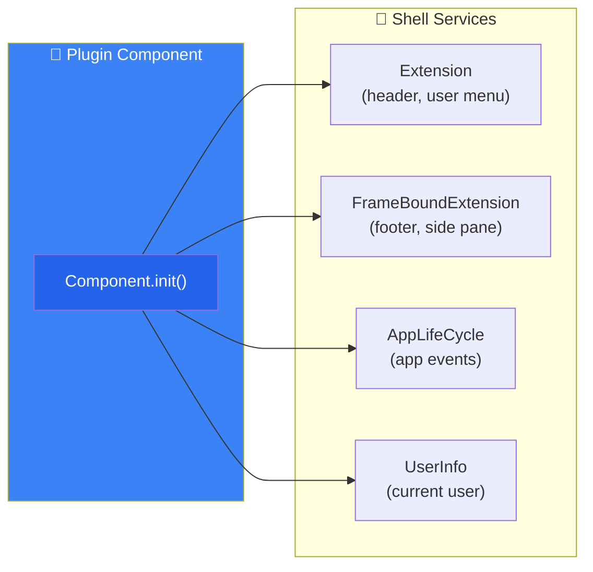

# Plugin Architecture — Simpler Than You Think

Basically a UI5 app... without views and controllers

<div class="two-col mt-2">

<div>

```ts
export default class Component extends UIComponent {
  public init(): void {
    super.init();
    // 👇 your plugin logic starts here

    const { config, startupParameters } =
      this.getComponentData() ?? {};
    // hook into shell services...
  }
}
```

Everything you know still works:

- ✅ OData models & component metadata
- ✅ `i18n` resource bundles
- ✅ Standard UI5 controls & libraries
- ✅ TypeScript, ESLint, UI5 Tooling

</div>

<div>



<div class="mt-2 text-sm opacity-70">

The only difference: instead of rendering a full UI,
you **hook into shell services**.

</div>

</div>

</div>
